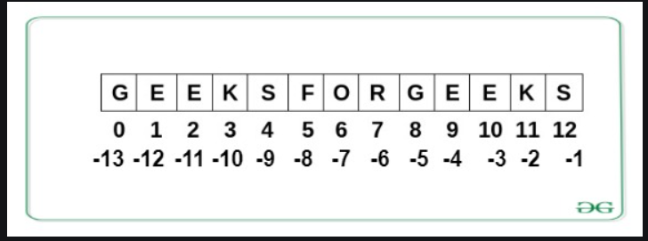

# Python String
### A String is a data structure in Python Programming that represents a sequence of characters. It is an immutable data type, meaning that once you have created a string, you cannot change it. 

## Table of Content

<ol>
<li>What is a String in Python?</li>
<li>Create a String in Python</li>
<li>Accessing characters in Python String</li>
<li>String Slicing Python</li>
<li>Python String Reversed</li>
<li>Deleting/Updating from a String</li>
<li>Escape Sequencing in Python</li>
<li>String methods</li>
</ol>

## What is a String in Python?
### Anything written inside the inverted commas is called string
### Example: "Hello, World!"
### Example of string data type in Python

```Python 
string_0 = "A Computer Science portal for geeks"
print(string_0)
print(type(string_0))
```
## Create a String in Python

### Strings in Python can be created using single quotes or double quotes or even triple quotes. Let us see how we can define a string in Python or how to write string in Python.

## Example:

## In this example, we will demonstrate different ways to create a Python String. We will create a string using single quotes (‘ ‘), double quotes (” “), and triple double quotes (“”” “””). The triple quotes can be used to declare multiline strings in Python.

``` Python 
# Creating a String
# with single Quotes
String1 = 'Welcome to the Geeks World'
print("String with the use of Single Quotes: ")
print(String1)

# Creating a String
# with double Quotes
String1 = "I'm a Geek"
print("\nString with the use of Double Quotes: ")
print(String1)

# Creating a String
# with triple Quotes
String1 = '''I'm a Geek and I live in a world of "Geeks"'''
print("\nString with the use of Triple Quotes: ")
print(String1)

# Creating String with triple
# Quotes allows multiple lines
String1 = '''Geeks
            For
            Life'''
print("\nCreating a multiline String: ")
print(String1)
```
## Accessing characters in Python String
### individual characters of a String can be accessed by using the method of Indexing. Indexing allows negative address references to access characters from the back of the String, e.g. -1 refers to the last character, -2 refers to the second last character, and so on.



## Python String Positive Indexing
```Python 
String1 = "GeeksForGeeks"
print("Initial String: ", String1)

# Printing First character
print("First character of String is: ", String1[0])
```
## Python String Negative Indexing

``` Python 
String1 = "GeeksForGeeks"
print("Initial String: ", String1)

# Printing Last character
print("Last character of String is: ", String1[-3])
```

## String Slicing Python
### In Python Programming tutorials, the String Slicing method is used to access a range of characters in the String. Slicing in a String is done by using a Slicing operator, i.e., a colon (:).  One thing to keep in mind while using this method is that the string returned after slicing includes the character at the start index but not the character at the last index.

``` Python 
# Creating a String
String1 = "GeeksForGeeks"
print("Initial String: ")
print(String1)

# Printing 3rd to 12th character
print("\nSlicing characters from 3-12: ")
print(String1[3:12])

# Printing characters between
# 3rd and 2nd last character
print("\nSlicing characters between " +
      "3rd and 2nd last character: ")
print(String1[3:-2])
```

## Python String Reversed

###  We can Reverse a string by using String slicing method.
```Python
#Program to reverse a string
gfg = "geeksforgeeks"
print(gfg[::-1])
```

## Deleting/Updating from a String

### In Python, the Updation or deletion of characters from a String is not allowed.
### Updating a character
```python
# Python Program to Update
# character of a String

String1 = "Hello, I'm a Geek"
print("Initial String: ")
print(String1)

# Updating a character of the String
## As python strings are immutable, they don't support item updation directly
### there are following two ways
#1
list1 = list(String1)
list1[2] = 'p'
String2 = ''.join(list1)
print("\nUpdating character at 2nd Index: ")
print(String2)

#2
String3 = String1[0:2] + 'p' + String1[3:]
print(String3)
```

## Deleting a character
### Python strings are immutable, that means we cannot delete a character from it. When we try to delete thecharacter using the del keyword, it will generate an error.
```python
# Python Program to delete
# character of a String

String1 = "Hello, I'm a Geek"
print("Initial String: ")
print(String1)

print("Deleting character at 2nd Index: ")
del String1[2]
print(String1)
```

## Escape Sequencing in Python

## While printing Strings with single and double quotes in it causes SyntaxError because String already contains Single and Double Quotes and hence cannot be printed with the use of either of these. Hence, to print such a String either Triple Quotes are used or Escape sequences are used to print Strings. 

``` Python
# Initial String
String1 = '''I'm a "Geek"'''
print("Initial String with use of Triple Quotes: ")
print(String1)

# Escaping Single Quote
String1 = 'I\'m a "Geek"'
print("\nEscaping Single Quote: ")
print(String1)

# Escaping Double Quotes
String1 = "I'm a \"Geek\""
print("\nEscaping Double Quotes: ")
print(String1)

# Printing Paths with the
# use of Escape Sequences
String1 = "C:\\Python\\Geeks\\"
print("\nEscaping Backslashes: ")
print(String1)

# Printing Paths with the
# use of Tab
String1 = "Hi\tGeeks"
print("\nTab: ")
print(String1)

# Printing Paths with the
# use of New Line
String1 = "Python\nGeeks"
print("\nNew Line: ")
print(String1)
```
# Python operations or functions or methods
 
## Case Changing of Python String Methods

1. lower(): Converts all uppercase characters in a string into lowercase
1. upper(): Converts all lowercase characters in a string into uppercase
1. title(): Convert string to title case
1. swapcase(): Swap the cases of all characters in a string
1. capitalize(): Convert the first character of a string to uppercase

```python
# Python3 program to show the
# working of upper() function
text = 'geeKs For geEkS'

# upper() function to convert
# string to upper case
print("\nConverted String:")
print(text.upper())

# lower() function to convert
# string to lower case
print("\nConverted String:")
print(text.lower())

# converts the first character to 
# upper case and rest to lower case 
print("\nConverted String:")
print(text.title())

# swaps the case of all characters in the string
# upper case character to lowercase and viceversa
print("\nConverted String:")
print(text.swapcase())

# convert the first character of a string to uppercase
print("\nConverted String:")
print(text.capitalize())

# original string never changes
print("\nOriginal String")
print(text)
```


## casefold()  same as .lower()

```python
string = "GEEKSFORGEEKS"

print("lowercase string: ", string.casefold())
```
## Python String center() method creates and returns a new string that is padded with the specified character
```python
string = "geeks for geeks"

new_string = string.center(24)

# here fillchar not provided so takes space by default.
print("After padding String is: ", new_string)
```
## Example 2: center() Method With ‘#’ as fillchar
```python
string = "geeks for geeks"

new_string = string.center(24, '#')

# here fillchar is provided
print("After padding String is:", new_string)
```
## Python String count() function returns the number of occurrences of a substring within a String.

```python
#initializing a string
my_string = "Apple"
#using string count() method
char_count = my_string.count('A')
#printing the result
print(char_count)
```
## Python String endswith() Method
## The endswith() method returns True if the string ends with the specified value, otherwise False.

```python
string = "geeksforgeeks"
print(string.endswith("geeks"))
```
## Python endswith() without start and end Parameters
```python
text = "geeks for geeks."

# returns False
result = text.endswith('for geeks')
print (result)

# returns True
result = text.endswith('geeks.')
print (result)

# returns True
result = text.endswith('for geeks.')
print (result)

# returns True
result = text.endswith('geeks for geeks.')
print (result)
```

## Python endswith() With start and end Parameters
```python
text = "geeks for geeks."

# start parameter: 10
result = text.endswith('geeks.', 10)
print(result)

# Both start and end is provided
# start: 10, end: 16 - 1
# Returns False
result = text.endswith('geeks', 10, 16)
print(result)

# returns True
result = text.endswith('geeks', 10, 15)
print(result)
```

## expandtabs() method in Python
### Python String expandtabs() Method specifies the amount of space to be substituted with the “\t” symbol in the string.

```python
# initializing string
string = "i\tlove\tgfg"

# using expandtabs to insert spacing
print("Modified string using default spacing: ", end ="")
print(string.expandtabs())
print()

# using expandtabs to insert spacing
print("Modified string using less spacing: ", end ="")
print(string.expandtabs(2))
print()

# using expandtabs to insert spacing
print("Modified string using more spacing: ", end ="")
print(string.expandtabs(12))
print()
```

## Python String find() method
### Python String find() method returns the lowest index or first occurrence of the substring if it is found in a given string.
### String find() is an in-built function in Python that is used to find the index of a substring within a given string.

### It is a very easy and useful string function, that can help us find a given substring. It returns the index of the substring if it is found in the string, but if the substring is not present in the string it returns -1.

```python
string = " hello world is the first code of every programmer"
print(string.find("first"))
```
```python
word = 'geeks for geeks'

# Substring is searched in 'eks for geeks' 
print(word.find('ge', 2)) 

# Substring is searched in 'eks for geeks' 
print(word.find('geeks ', 2)) 

# Substring is searched in 's for g' 
print(word.find('g', 4, 10)) 

# Substring is searched in 's for g' 
print(word.find('for ', 4, 11)) 
```
## 3. Total Occurrences of a Substring using find()
# Will discuss this later
``` python
main_string = "Hello, hello, Hello, HELLO! , hello"
sub_string = "hello"
count_er=0
start_index=0
for i in range(len(main_string)):
  j = main_string.find(sub_string,start_index)
  if(j!=-1):
    start_index = j+1
    count_er+=1
print("Total occurrences are: ", count_er)  

```
## Python String index() Method
### Python String index() Method allows a user to find the index of the first occurrence of an existing substring inside a given string in Python.

```python 
string = 'random'
print("index of 'and' in string:", string.index('and'))
```
```python 
test_string = "1234gfg4321"
# finding gfg in string segment 'gfg4' 
print(test_string.index('gfg', 4, 8)) 

# finding "21" in string segment 'gfg4321' 
print(test_string.index("21", 8, len(test_string))) 

# finding "32" in string segment 'fg432' using negative index 
print(test_string.index("32", 5, -1)) 
```

## Python String isalnum() Method
### Python String isalnum() method checks whether all the characters in a given string are either alphabet or numeric (alphanumeric) characters.

```python
# here a,b and c are characters and 1,2 and 3
# are numbers
string = "abc123"
print(string.isalnum())
```

```python 
string = "abc 123"
print(string, "is alphanumeric?", string.isalnum())

string = "abc_123"
print(string, "is alphanumeric?", string.isalnum())

string = "000"
print(string, "is alphanumeric?", string.isalnum())

string = "aaaa"
print(string, "is alphanumeric?", string.isalnum())
```

```python
password = "user123456"

if password.isalnum():
	print("Password is alphanumeric.")
else:
	print("Password is not alphanumeric.")
```

## Python String isalpha() Method
### Python String isalpha() method is used to check whether all characters in the String are an alphabet.
```python
# checking for alphabets
string = 'Ayush'
print(string.isalpha())

string = 'Ayush0212'
print(string.isalpha())

# checking if space is an alphabet
string = 'Ayush Saxena'
print( string.isalpha())
```
## Python string isdecimal() Method

### Python String isdecimal() function returns true if all characters in a string are decimal, else it returns False. 

```python 
s = "12345"
print(s.isdecimal())

# contains alphabets
s = "12geeks34"
print(s.isdecimal())

# contains numbers and spaces
s = "12/34"
print(s.isdecimal())
```
## Python String isdigit() Method
### Python String isdigit() method returns “True” if all characters in the string are digits, Otherwise, It returns “False”.

```python
# checking for digit
string = '15460'
print(string.isdigit())

string = '154ayush60'
print(string.isdigit())
```

```python
s = "²"
print(s.isdigit())   # Output: True
print(s.isdecimal()) # Output: False
```
``` python
s = "Ⅳ"  # Roman numeral for 4
print(s.isdigit())   # Output: True
print(s.isdecimal()) # Output: False
```
## Python String isidentifier() Method
### Python String isidentifier() method is used to check whether a string is a valid identifier or not. The method returns True if the string is a valid identifier, else returns False.

## Note: A string is considered as a valid identifier if:

## It only consists of alphanumeric characters and underscore (_)
## Doesn’t start with a space or a number

```python
# String with spaces
string = "Geeks for Geeks"
print(string.isidentifier())

# A Perfect identifier
string = "GeeksforGeeks"
print(string.isidentifier())

# Empty string
string = ""
print(string.isidentifier())

# Alphanumerical string
string = "Geeks0for0Geeks"
print(string.isidentifier())

# Beginning with an integer
string = "54Geeks0for0Geeks"
print(string.isidentifier())
```
## Python String islower() method
### Python String islower() method checks if all characters in the string are lowercase. 
```python
print("geeks".islower())
```

## 